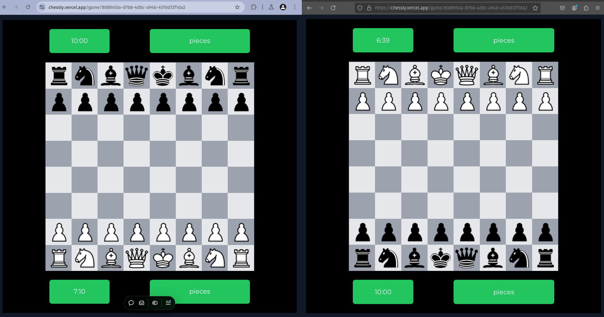

# Chess Multiplayer Web Application

## 🎲 Project Overview

This is a full-stack web application for playing chess online, featuring real-time gameplay, user authentication, and game management. Built with modern web technologies to provide an interactive and responsive chess experience.

## 🚀 Tech Stack

- **Frontend**: 
  - React.js

- **Backend**:
  - Node.js
  - Express.js
  - Prisma ORM
  - WebSocket for live game updates
  - PostgreSQL Database

## 📦 Prerequisites

Before you begin, ensure you have the following installed:
- Node.js (v16 or later)
- npm (v8 or later)
- PostgreSQL
- Git

## 🔧 Installation

### Clone the Repository
```bash
git clone https://github.com/Ravindra162/chessly.git
cd chess-multiplayer
```

### Frontend Setup
```bash
cd frontend
npm install
cp .env.example .env  # Copy and configure environment variables
npm run dev  # Start development server
```

### Backend Setup
```bash
cd backend
npm install
npx prisma generate  # Generate Prisma client
npx prisma migrate dev  # Run database migrations
cp .env.example .env  # Copy and configure database connection
npm run start  # Start backend server
```

## 🌟 Features

- User Registration and Authentication
- Real-time Chess Gameplay
- 10-minute Quick Play Mode
- Game History Tracking
- Responsive Design

## 📡 API Endpoints

### Authentication
- `POST /api/register`: User registration
- `POST /api/login`: User login

### Game Management
- `GET /api/games`: List active games
- `GET /api/games/:id`: Get specific game details
- `POST /api/move`: Make a move in a game

## 🗂️ Project Structure

```
chess-multiplayer/
│
├── frontend/
│   ├── src/
│   │   ├── components/
│   │   ├── pages/
│   │   └── App.jsx
│   └── vite.config.js
│
├── backend/
│   ├── gameManager.js
│   ├── server.js
│   └── prisma/
│       └── schema.prisma
│
└── README.md
```

## 🔒 Environment Variables

### Frontend (`.env`)
- `VITE_API_URL`: Backend API base URL
- `VITE_WEBSOCKET_URL`: WebSocket connection URL

### Backend (`.env`)
- `DATABASE_URL`: PostgreSQL connection string
- `JWT_SECRET`: Secret key for token generation

## 🧪 Testing

```bash
# Frontend Tests
cd frontend
npm run test

# Backend Tests
cd backend
npm run test
```

## Chess view (Multiplayer)



## 🚧 Deployment

### Frontend
- Build: `npm run build`
- Deploy to platforms like Netlify, Vercel, or Cloudflare Pages

### Backend
- Deploy to platforms like Heroku, DigitalOcean, or AWS
- Ensure PostgreSQL database is configured

## 📝 Contributing

1. Fork the repository
2. Create your feature branch (`git checkout -b feature/AmazingFeature`)
3. Commit your changes (`git commit -m 'Add some AmazingFeature'`)
4. Push to the branch (`git push origin feature/AmazingFeature`)
5. Open a Pull Request
